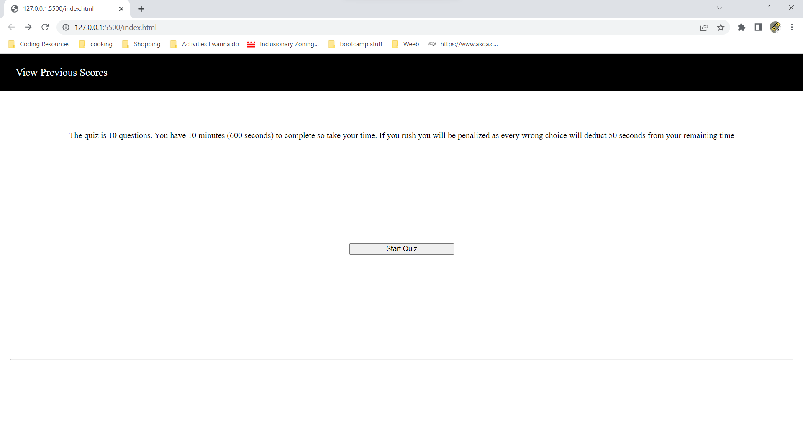
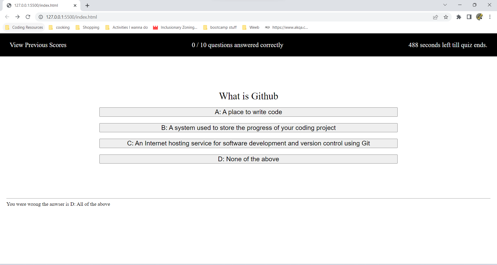
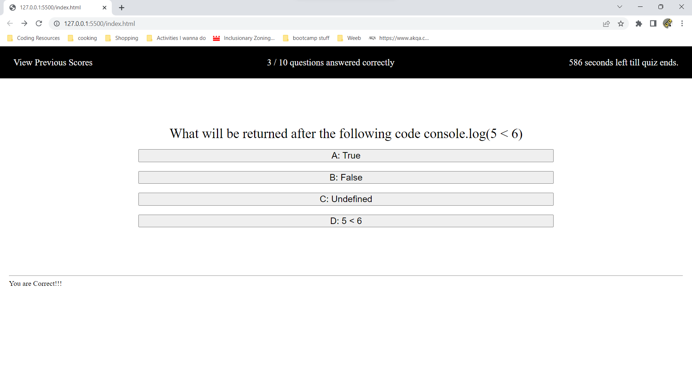
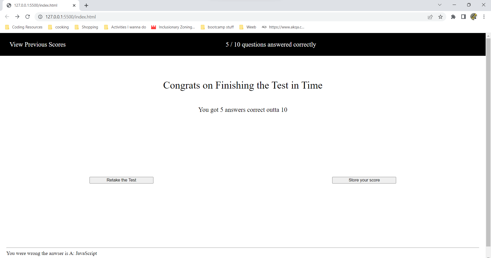
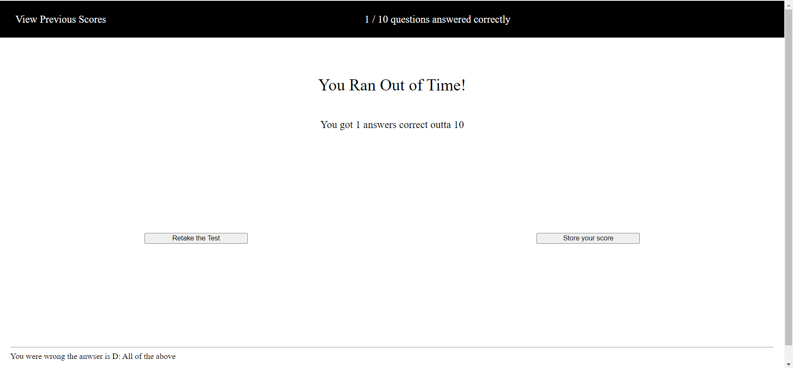
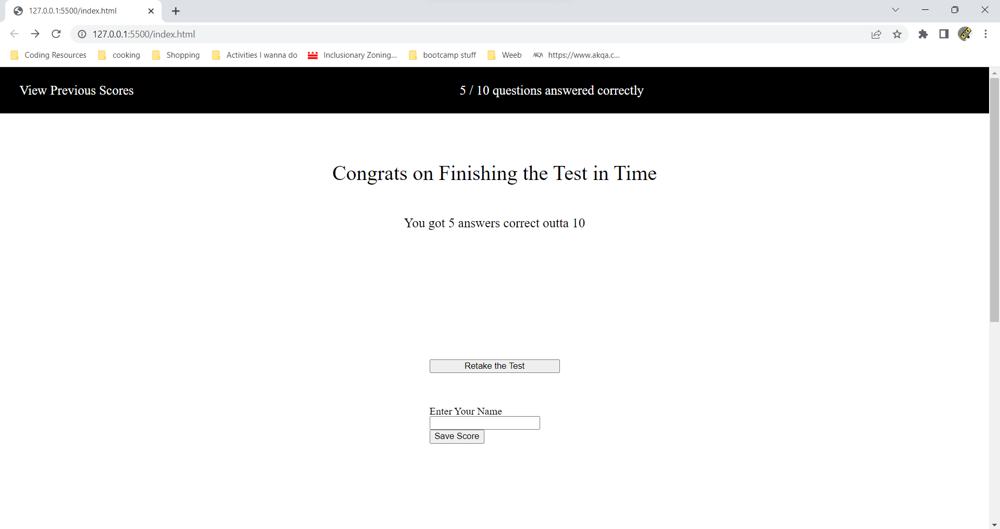
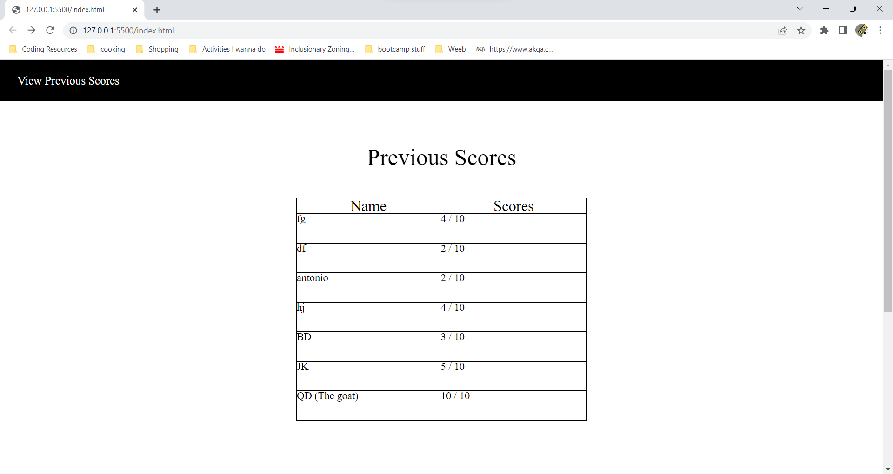

#Coding Quiz

## Description

-This is a 10 question quiz that keeps a local storage of past scores. 
-This is a project meant to fully comprehend DOM manipulation and the ability to create events and attach event listeners to elements.

## Usage

Provide instructions and examples for use. Include screenshots as needed.

To add a screenshot, create an `assets/images` folder in your repository and upload your screenshot to it. Then, using the relative file path, add it to your README using the following syntax:

- The front page explains the rules and has a start button in the center

-After you click the start button you are shown the quizBox which presents a question and 4 answer buttons to answer said question. Your time is on the top hand corner. The amount of correct questions you get also shown in the header

-When you finish the screen you can save your score or choose to retake the test
-Depending on if you ran out of time or not you will get 2 different responses

-Choosing to save your grades results in an input being generated for you to give a name

-When you save your results it is stored locally and displayed on the chart. This is accessible at any point of the site at the top left corner. 
-Choosing to view the scoreList will result in your current progress to be lost.

#Live Site Link
-Live Site: https://qdatcher.github.io/module4challenge_quiz/
-Github: https://github.com/QDatcher/module4challenge_quiz